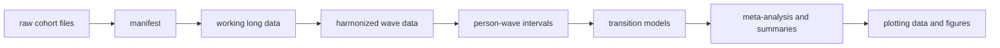
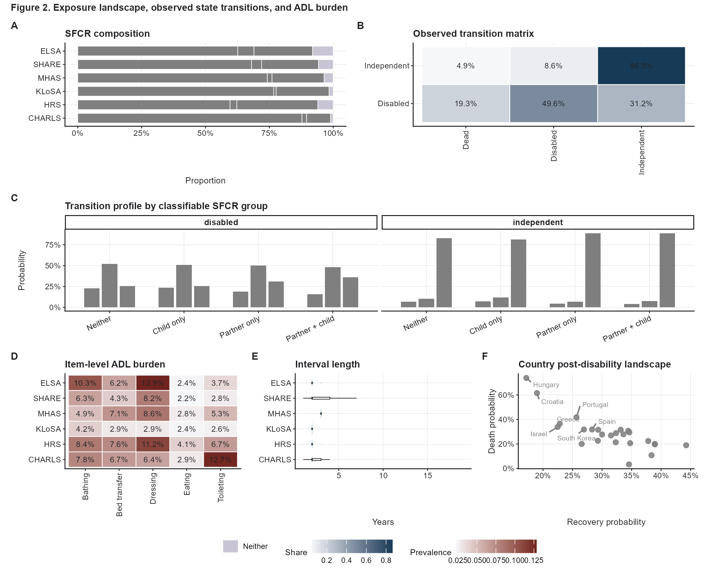
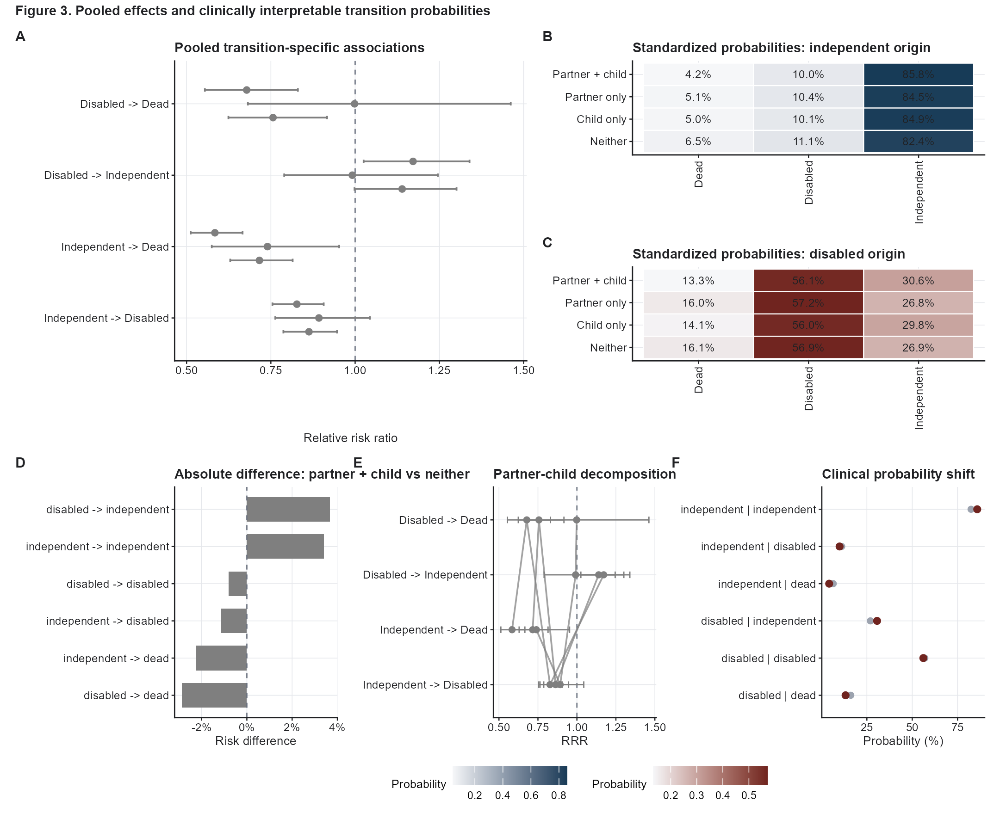
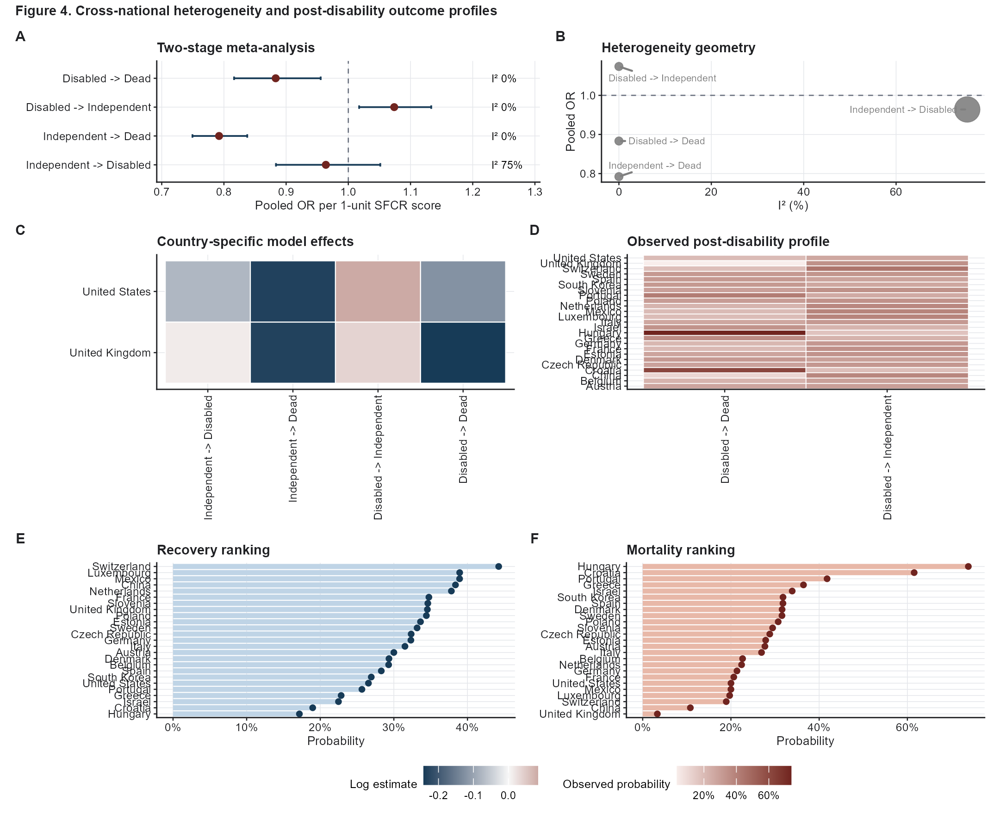

# sfcr-transitions

Reproducible R code for the project:

**Structural Family Care Reserve and Disability Transitions in Later Life**

The project harmonizes HRS-family ageing cohorts, builds person-wave transition
intervals, estimates discrete-time multistate models, and exports manuscript-ready
plotting data and figures. The final analysis is a six-cohort rerun using CHARLS,
HRS, KLoSA, MHAS, SHARE, and ELSA; LASI is scanned by the harmonization workflow but
excluded from the final interval-based rerun.

## What is included

- R code from raw-data scanning to harmonized wave data, interval construction, models,
  meta-analysis, tables, and final plotting data.
- `targets` workflow for reproducible execution.
- Raw-data folder placeholders.
- A few low-resolution figure previews for orientation only.

## What is not included

- No raw cohort data.
- No derived individual-level data.
- No source-data CSVs generated for figures.
- No model objects or manuscript output folders.

These files are intentionally excluded by `.gitignore`.

## Data setup

Extract the supplied data archive into:

```text
data_raw/
  CHARLS/
  HRS/
  KLoSA/
  LASI/
  MHAS/
  SHARE/
  ELSA/
```

The code scans `data_raw/` recursively, so exact internal folder names can differ from
the sketch above.

## Run

```r
install.packages("renv")
renv::restore()
targets::tar_make()
```

Or from a terminal:

```bash
Rscript run.R
```

Main generated outputs will appear under `outputs/`. These outputs are ignored by git.

## Workflow



## Script map

- `R/00_utils.R`: shared utilities and cohort catalog.
- `R/01_manifest.R`: file audit and cohort manifest.
- `R/02_prepare_long.R`: read cohort working files into long format.
- `R/03_prepare_supplements.R`: prepare auxiliary source variables.
- `R/04_harmonize.R`: construct harmonized wave-level variables.
- `R/05_codebooks.R`: export harmonization codebooks.
- `R/06_intervals.R`: build person-wave transition intervals.
- `R/07_models.R`: one-stage transition models.
- `R/08_meta_summary.R`: two-stage meta-analysis and result summaries.
- `R/09_tables.R`: core table exports.
- `R/10_six_country_run.R`: final six-cohort rerun and plotting-data products.
- `R/11_nature_figures.R`: final R figure exports, starting from Figure 2; Figure 1 is intentionally not exported in this public code package.
- `R/12_nature_tables.R`: final table bundle used for manuscript writing.

## Preview figures

These previews are included only to show the expected visual style; regenerate all
analytic source data and final figures locally after placing the raw data in
`data_raw/`.







## Notes

- SHARE respondent country is preserved and used as the country-level unit.
- ADL disability is reconstructed from five harmonized ADL items.
- `SFCR` is defined from partnered status and living-child availability.
- The repository is prepared for code sharing. It is not a data repository.
